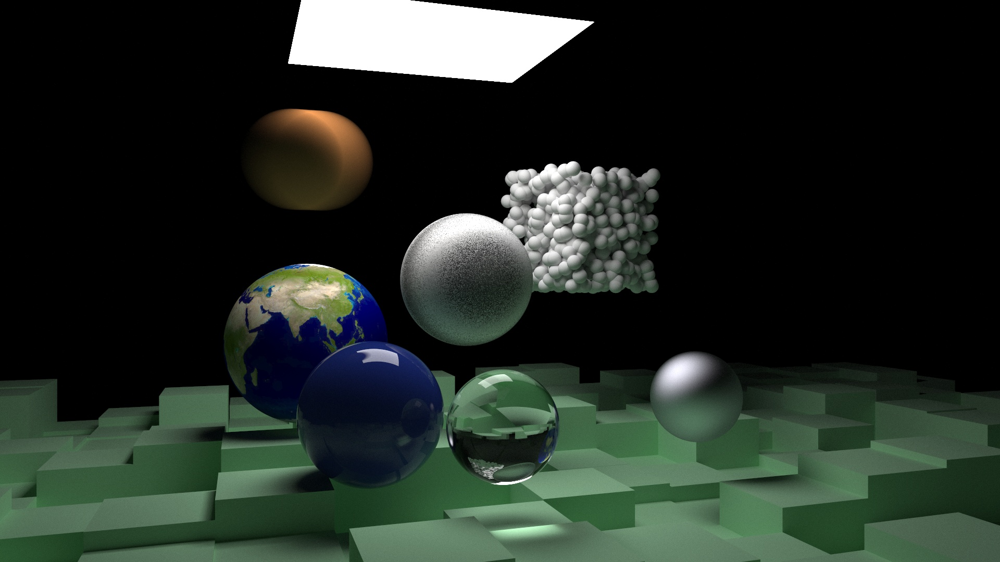

# render

Follow the implementation of [*Ray Tracing In One Weekend*](https://raytracing.github.io/books/RayTracingInOneWeekend.html).

## Requirements

C++ standard: c++17 or higher

Python: python3 with cv2(opencv-python) installed

## Run

Simply run `make all -s` on a Linux shell

## Current Status

