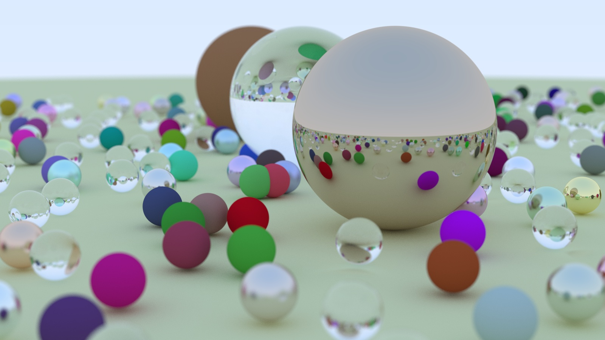
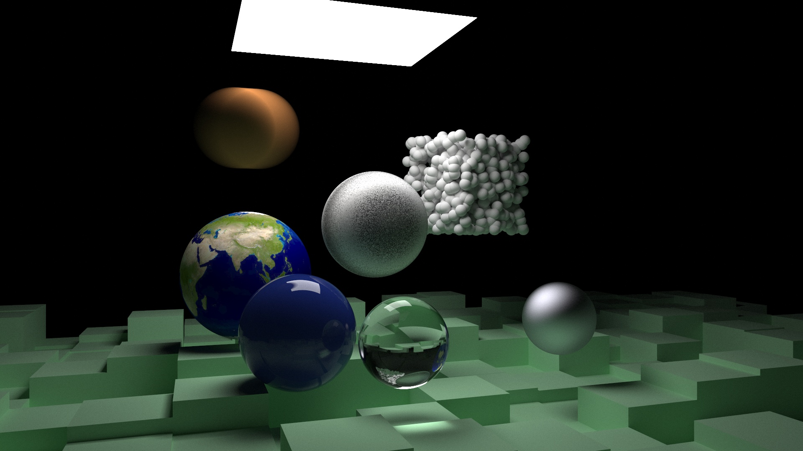
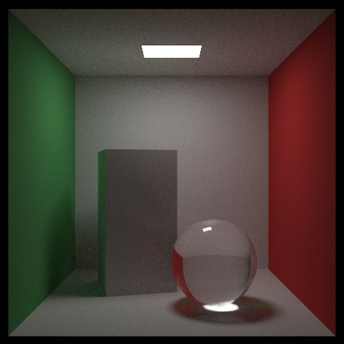

# render

Follow the implementation of [*Ray Tracing In One Weekend*](https://raytracing.github.io/books/RayTracingInOneWeekend.html), [*Ray Tracing The Next Week*](https://raytracing.github.io/books/RayTracingTheNextWeek.html) and [*Ray Tracing The Rest Of Your Life*](https://raytracing.github.io/books/RayTracingTheRestOfYourLife.html).

## Current Status

Finish all 3 books, now open for debugging and adding new features.

## Requirements

C++ standard: -std=c++17

Python: python3 with cv2(pip install opencv-python) installed

## Run

Simply run `make all -s` on a Linux shell

`make new -s` can generate new `current.jpg`

## Current Status

